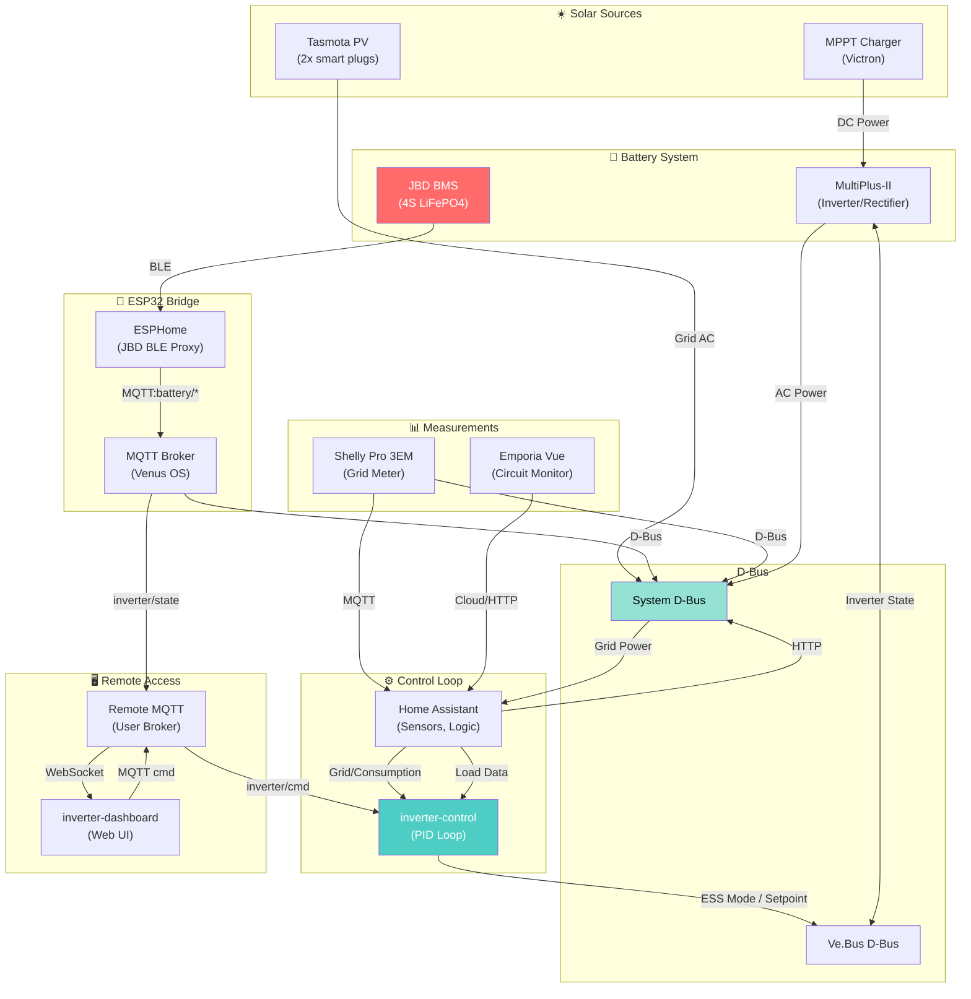
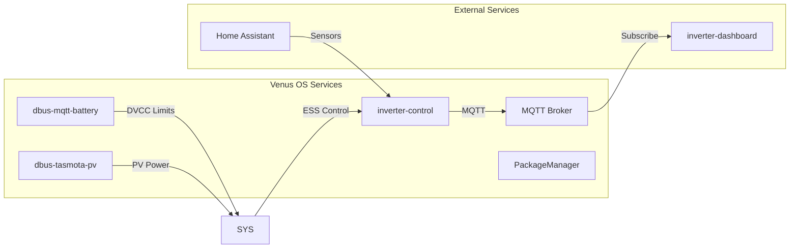
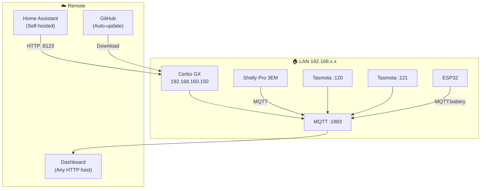
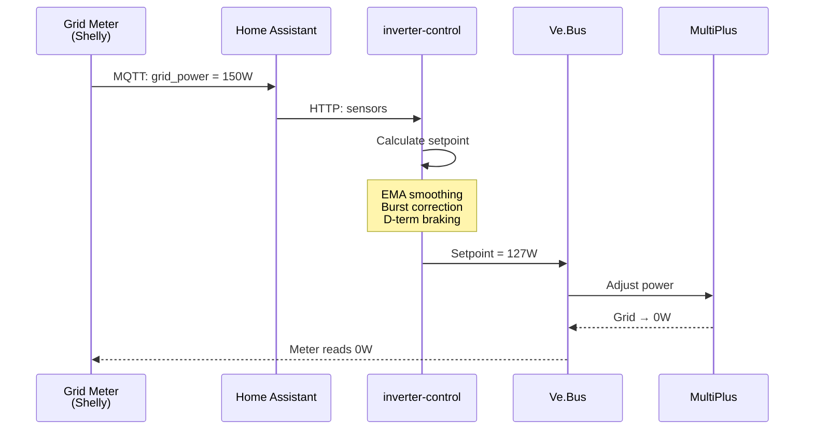

# System Architecture

## Data Flow Diagram



## Service Dependencies



## Network Topology



## Control Loop Timing



## Runbook: Troubleshooting

### ⚠️ Battery Disconnected

**Symptoms:**
- Dashboard shows stale battery data
- DVCC limits not updating
- `/System/StaleData = 1` in D-Bus

**Actions:**
```bash
# Check ESP32 connection
ssh cerbo
tail -f /var/log/dbus-mqtt-battery/current | tai64nlocal

# Check MQTT subscription
mosquitto_sub -v -t "battery/#" | head -20

# Restart service
svc -t /service/dbus-mqtt-battery

# Check backup
cp -a /data/dbus-mqtt-battery.rollback /data/dbus-mqtt-battery
svc -t /service/dbus-mqtt-battery
```

### ⚠️ Grid Failure

**Symptoms:**
- ESS mode shows "Passthru"
- No grid export/import control
- Console shows `[PT]` flag

**Actions:**
```bash
# Verify grid meter
dbus -y com.victronenergy.grid.meter0

# Check ESS mode
svxadmin display

# Manual restart
svc -t /service/inverter-control

# Check D-Bus connectivity
python3 -c "
import dbus
bus = dbus.SystemBus()
obj = bus.get_object('com.victronenergy.system', '/System')
print(obj.process_names())
"
```

### ⚠️ MQTT Broker Crash

**Symptoms:**
- Dashboard shows "connecting..."
- Services report MQTT errors
- inverter/state topic not updating

**Actions:**
```bash
# Restart MQTT
svc -t /service/mqtt-broker

# Verify connection
mosquitto_sub -v -t "\$SYS/#" -C 1

# Check service logs
tail -50 /var/log/inverter-control/current | tai64nlocal
```

### ⚠️ Watchdog Triggered Restart

**Symptoms:**
- Service was restarted by watchdog
- `/tmp/inverter-control.heartbeat` timestamp old
- Alert: "ROLLBACK: service failed health check"

**Actions:**
```bash
# Check heartbeat
cat /tmp/inverter-control.heartbeat
date -r /tmp/inverter-control.heartbeat

# View service status
svstat /service/inverter-control

# Check for repeated restarts
ls -la /tmp/.watchdog_restarts/

# Disable watchdog for testing
svc -d /service/watchdog

# Re-enable after fix
svc -u /service/watchdog
```

### ⚠️ Dashboard Not Loading

**Symptoms:**
- Web UI shows blank or timeout
- WebSocket error in browser console

**Actions:**
```bash
# Check Docker container
ssh nas
docker ps | grep inverter-dashboard
docker logs inverter-dashboard

# Check MQTT connection
docker exec inverter-dashboard sh -c 'nc -zv MQTT_HOST 1883'

# Restart container
docker restart inverter-dashboard

# Check TLS certs
ls -la /volume1/docker/inverter-dashboard/config/
```

---

## Emergency Contacts

| Issue | First Action | Escalation |
|-------|-------------|------------|
| Battery BMS alarm | Check ESP32 BLE connection | Replace BMS |
| Grid meter failure | Use backup Shelly | Install VM-3P75CT |
| Inverter fault | Check VE.Bus status | Call Victron support |
| Data loss | Restore from backup | Check InfluxDB |