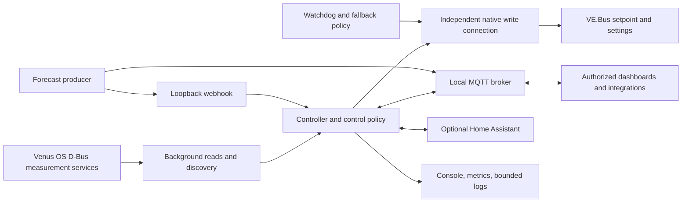

# System architecture

Inverter Control is a supervised Venus OS daemon. It does not host a web
dashboard. Remote dashboards consume MQTT; Home Assistant is an optional
integration rather than the owner of the seven inverter control flags.

```mermaid
flowchart LR
  peers[Venus OS D-Bus measurement services] --> reads[Background reads and discovery]
  reads --> controller[Controller and control policy]
  controller --> writer[Independent native write connection]
  writer --> inverter[VE.Bus setpoint and settings]
  controller <--> broker[Local MQTT broker]
  broker <--> clients[Authorized dashboards and integrations]
  forecast[Forecast producer] --> broker
  forecast --> webhook[Loopback webhook]
  webhook --> controller
  controller <--> ha[Optional Home Assistant]
  controller --> diagnostics[Console, metrics, bounded logs]
  watchdog[Watchdog and fallback policy] --> writer
```

`main.py` owns startup, CLI and MQTT command registration. The Python modules
live under `inverter_control/`; private `local_config.py` lives at the package
root. `controller.py` owns integration/state coordination; `logic.py` calculates
setpoints. `victron.py` and `dbus.py` provide local device I/O. The native reader
and writer use separate connections; a CLI fallback validates write replies.
See [native write isolation](../../docs/native-write-isolation.md).

The process receives untrusted protocol data through a trusted deployment
boundary. The local system bus, private Python configuration and command-topic
publishers can influence hardware. See [security design](../../docs/security-design.md)
for assets, limits and required access control, and
[interfaces](../../docs/interfaces.md) for input/output contracts.

A fresh transport connection is not proof of a fresh measurement. Source identity,
phase topology, timestamps and recovery gates determine whether grid control is
available. [Grid telemetry safety](../../docs/grid-telemetry-safety.md) documents
fallback behavior. Auxiliary display readers have independent timing and do not
replace primary control measurements.

The installer preserves configuration and service directory inodes, installs
persistent daemontools launchers under `/data/inverter-control/service`, and
recreates volatile `/service` links after reboot. Separate watchdog and deployment
keepalive processes have distinct roles. Read the
[operations guide](../../docs/venus-os-operations.md) before stopping or upgrading
a device. Automated tests exercise these paths with mocks; site acceptance must
measure actual power behavior and failure recovery.

The older [architecture decisions](adr-001-grid-zero-architecture.md) preserve
historical site context. This document and the linked current contracts describe
the supported code; the historical hardware examples are not requirements.
