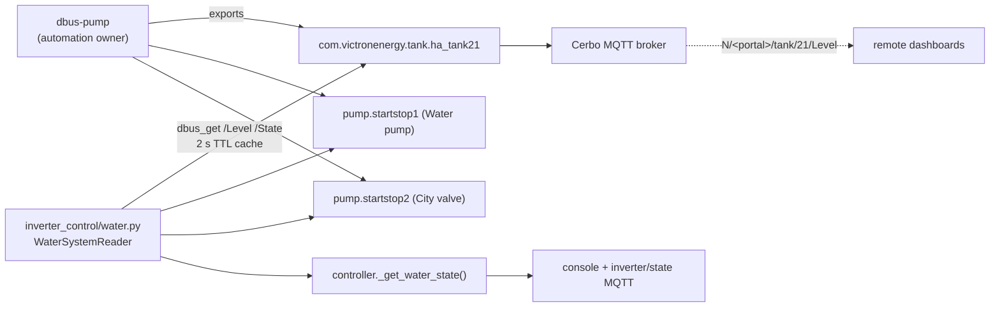

# Inverter Control - Code Architecture

## Module Structure

```
inverter_control/
├── main.py              # Entry point + InverterController class
├── config.py            # Configuration constants and settings
├── victron.py           # D-Bus communication with Victron Venus OS
├── water.py             # Water system reader (dbus-pump D-Bus services)
├── homeassistant.py     # Home Assistant REST API integration
├── mqtt_bridge.py       # MQTT bridge for remote dashboard
├── ui_config.py         # UI configuration for dashboard
├── keepalive.py         # Keepalive/watchdog functionality
├── secrets.py           # API keys and sensitive data (gitignored)
└── version              # Version file for SetupHelper
```

## main.py - InverterController

The main controller class (~800 lines) handles:

### Initialization (lines 89-180)
- `__init__` - Setup D-Bus, Home Assistant, UI config

### Setpoint Calculation (lines 187-446)
- `calculate_setpoint` - Core algorithm for grid-zero feed-in
- Handles modes: ONLY_CHARGING, NO_FEED, HOUSE_SUPPORT, etc.
- EMA smoothing, split-phase compensation

### Console Output (lines 447-580)
- `format_console_output` - Terminal display formatting
- `update_terminal_title` - Screen/tmux title updates

### State Management (lines 581-695)
- `update_state` - Collect data for MQTT/dashboard
- `get_state` - Return current state dict

### Control Loop (lines 696-764)
- `run_cycle` - Main control cycle
- Watchdog, error handling

### Main Entry Point (lines 765-877)
- `main` - Argument parsing, MQTT bridge setup
- Signal handlers, exception hooks

## victron.py

D-Bus interface to Victron Venus OS:
- System data (grid, battery, solar)
- ESS mode control
- MPPT charger data
- Battery chain monitoring

## water.py

Water system reader over the dbus-pump D-Bus services (no Home Assistant):
- Tank level: `com.victronenergy.tank.ha_tank{WATER_TANK_INSTANCE}` `/Level` (%)
- Valve/pump: `com.victronenergy.pump.startstop{WATER_VALVE|PUMP_INSTANCE}` `/State`
- TTL cache (2 s); a missing service yields `None` ("no data"), never 0
- Instances must match dbus-pump's `local_config.py`



Valve/pump automation (hysteresis, stale-sensor fail-safe) lives entirely in
dbus-pump; this project only reads state.

## homeassistant.py

Home Assistant integration:
- REST API communication
- Boolean toggles (input_boolean.*)
- Vue energy sensors
- Switch control

## config.py

All configuration constants:
- Power limits, deadbands
- Feature flags (ENABLE_EV, ENABLE_WATER — water is D-Bus-based via dbus-pump)
- Water D-Bus instances (WATER_TANK_INSTANCE / WATER_PUMP_INSTANCE / WATER_VALVE_INSTANCE)
- HA entity mappings (non-water features)
- UI settings

## mqtt_bridge.py

MQTT communication for remote dashboard:
- State publishing
- Command receiving
- WebSocket bridge
