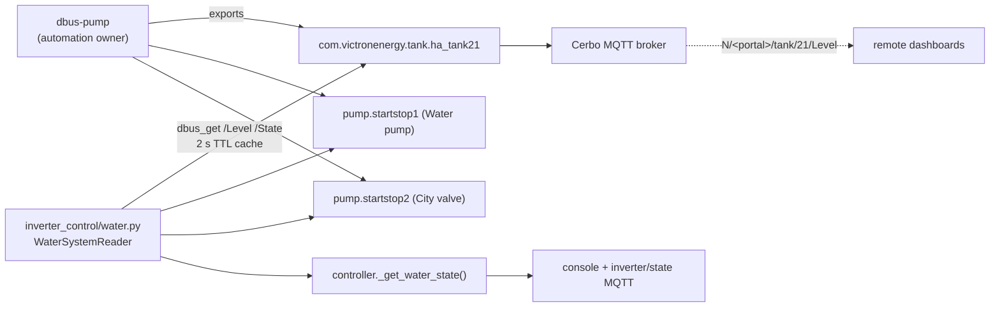

# Inverter Control - Code Architecture

## Module Structure

```
inverter-control/
├── main.py                  # Process entry point and MQTT command routing
├── inverter_control/
│   ├── controller.py        # Control loop and authoritative inverter flag state
│   ├── control_flags.py     # Canonical flag keys and dashboard button definitions
│   ├── config.py            # Tuning, optional integrations and UI configuration
│   ├── victron.py           # Venus D-Bus I/O and control-flag Settings mirror
│   ├── water.py             # dbus-pump water system reader
│   ├── homeassistant.py     # Optional HA sensors and dump-load actuators
│   ├── mqtt_bridge.py       # MQTT state publication and command subscription
│   └── console_ui.py        # Console presentation
├── mqtt.yaml                # Optional HA MQTT consumers of daemon-owned flags
└── local_config.example.py  # Template for the untracked local_config.py
```

## controller.py and control_flags.py

`InverterController` owns grid-zero calculation, control-loop lifecycle, current
state and inverter flags. `control_flags.py` defines the seven control keys and
their desktop labels. The controller's `_control_flags` dictionary is
independent of HA; `get_control_flag()` and `set_control_flag()` are the canonical
internal API. `get_boolean()` and `set_boolean()` remain compatibility aliases.

`config.py` includes the control definitions in `ui_config.header_toggles`.
`controller.py` publishes these definitions and current flag values (`booleans`)
on retained `inverter/state`, including before the first telemetry sweep.
`_get_ha_status()` contains only the optional HA connection status.

Flags start off at every daemon restart. Their Venus Settings values are a
mirror for display, not an external command input or restart restore source.
The [MQTT control contract](docs/mqtt-control-flags.md) specifies topics, payloads,
compatibility aliases and the distinction between Desktop metadata and HA config.

## main.py

The process entry point creates the controller and MQTT bridge, manages signal
handlers and drives the control loop. Recognized `cmd/toggle` keys are handled by
the controller without HA. Other legacy entity commands can be forwarded to the
optional HA client. The `input_boolean.` prefix on a known flag is accepted only
for compatibility; it does not make the flag an HA entity.

## victron.py

D-Bus interface to Victron Venus OS:
- System data (grid, battery, solar)
- ESS mode control
- MPPT charger data
- Battery chain monitoring

## water.py

Water system reader over the dbus-pump D-Bus services (no Home Assistant):
- Tank level: `com.victronenergy.tank.ha_tank{WATER_TANK_INSTANCE}` `/Level` (%)
- Valve/pump: `com.victronenergy.pump.startstop{WATER_VALVE|PUMP_INSTANCE}` `/State`
- TTL cache (2 s); a missing service yields `None` ("no data"), never 0
- Instances must match dbus-pump's `local_config.py`



Valve/pump automation (hysteresis, stale-sensor fail-safe) lives entirely in
dbus-pump; this project only reads state.

## homeassistant.py

Home Assistant integration:
- REST API communication
- Optional energy sensors
- Dump-load switch control and legacy forwarding for genuine HA entities

Inverter control flags do not live here. The `minimize_charging` flag remains
daemon-owned, while its current dump-load automation still uses HA sensor data
and HA service calls. Desktop and HA can both consume and change flags over MQTT
independently.

## config.py

All configuration constants:
- Power limits, deadbands
- Feature flags (ENABLE_EV, ENABLE_WATER — both D-Bus-based: evcharger.py reads com.victronenergy.evcharger / com.victronenergy.ev; water reads com.victronenergy.tank / com.victronenergy.pump)
- Water D-Bus instances (WATER_TANK_INSTANCE / WATER_PUMP_INSTANCE / WATER_VALVE_INSTANCE)
- HA entity mappings (non-water features)
- UI settings

## mqtt_bridge.py

MQTT communication for remote dashboard:
- Retained state publishing on `<prefix>/state`, including flags and button metadata
- Command receiving on `<prefix>/cmd/#`
- Optional HA MQTT switches configured separately in `mqtt.yaml`

Broker transport and HA REST integration are separate. This module does not
publish HA discovery messages or implement a WebSocket server.
