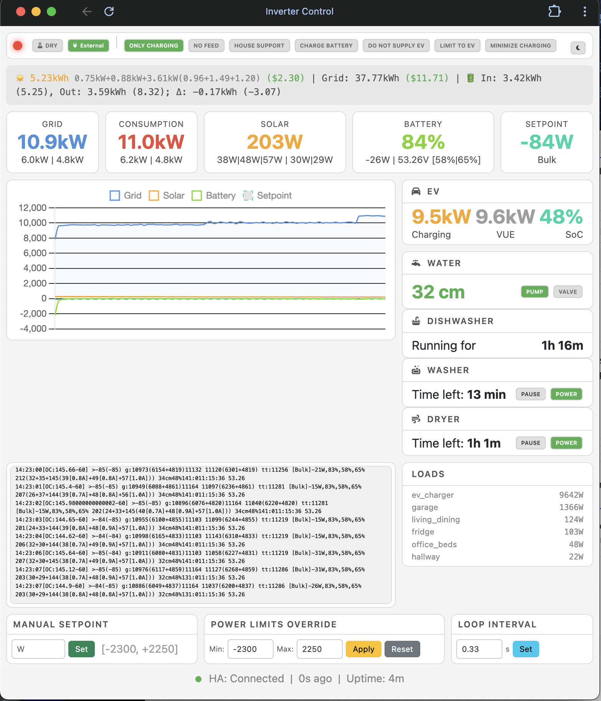

# Inverter Control

[](https://github.com/victron-venus/inverter-control/actions/workflows/ci.yml)
[](https://opensource.org/licenses/MIT)
[](https://github.com/victron-venus/inverter-control/releases)
[](https://github.com/victron-venus/inverter-control/releases)
[](https://www.python.org/downloads/)
[](https://github.com/victronenergy/venus)
[](https://github.com/victron-venus/inverter-control)
[](https://github.com/victron-venus/inverter-control/stargazers)
[](https://github.com/victron-venus/inverter-control/network/members)
[](https://github.com/victron-venus/inverter-control/watchers)
[](https://github.com/victron-venus/inverter-control/graphs/contributors)
[](https://github.com/victron-venus/inverter-control/issues)
[](https://github.com/victron-venus/inverter-control/issues?q=is%3Aissue+is%3Aclosed)
[](https://github.com/victron-venus/inverter-control/pulls)
[](https://github.com/victron-venus/inverter-control/commits/main)
[](https://github.com/victron-venus/inverter-control)
[](https://github.com/victron-venus/inverter-control)
[](https://github.com/victron-venus/inverter-control/graphs/commit-activity)
[](https://github.com/victron-venus/inverter-control/pulls)
[](https://www.python.org/)
[](https://community.victronenergy.com/)

Grid-zero feed-in controller for Victron systems with split-phase compensation.

> **Disclaimer**: Most grid-zero goals can be achieved using Victron's built-in **ESS Optimized (without BatteryLife)** mode. This project exists for specific edge cases requiring custom logic (split-phase compensation, EV charger exclusion, multiple solar sources, etc.). This code was developed for a particular setup and is unlikely to work as a drop-in solution — treat it as a learning resource or starting point for your own implementation.

## Overview

This Python application controls a Victron inverter to maintain zero grid feed-in/consumption while supporting various operating modes. It's designed for split-phase (120/240V) systems where L2 loads need to be compensated by L1 export.

```
[Solar] → [MPPT] → [Battery] ← → [Inverter] ← → [Grid L1]
                                      ↓
[Tasmota PV] → [AC Grid] ←------------|
                                      |
                    [Loads L1] ←------|
                    [Loads L2] ←------ Grid L2 (no inverter)
```

## Screenshot



## Features

- **Grid-Zero Control**: Maintains net zero power at the utility meter
- **Split-Phase Compensation**: Exports on L1 to offset L2 consumption
- **Multiple Operating Modes**:
  - Normal: Automatic grid-zero targeting
  - Only Charging: Use solar only, don't discharge battery
  - No Feed: Only use Tasmota PV, no battery
  - House Support: Tasmota PV minus 300W
  - Charge Battery: Force battery charging
  - Do Not Supply Charger: EV charges from grid only
- **Minimize Charging**: Auto-control dump loads to consume excess solar
- **Web Dashboard**: Real-time monitoring and control
- **Home Assistant Integration**: Sensor data and switch control
- **Fast Control Loop**: 3 updates per second via D-Bus

## Architecture

```
inverter_control/
├── config.py           # Non-sensitive parameters
├── secrets.py          # Sensitive config (not in git)
├── secrets.example.py  # Template for secrets.py
├── main.py             # Main control loop and console output
├── victron.py          # D-Bus interface for Victron devices
├── homeassistant.py    # HA API with caching and fallback
├── web/
│   ├── server.py       # HTTP server and dashboard
│   └── __init__.py
├── deploy.sh           # Deploy to Venus OS
├── install.sh          # Install on Venus OS
├── LOGIC.md            # Control logic documentation (EN)
└── README.md
```

## Configuration

1. Copy `secrets.example.py` to `secrets.py`
2. Edit `secrets.py` with your actual values:

```python
# Home Assistant connection
HA_URL = "http://YOUR_HA_IP:8123"
HA_TOKEN = "your_long_lived_access_token"

# Victron Portal ID (from VRM)
PORTAL_ID = "your_portal_id"

# Tasmota device IPs
TASMOTA_IPS = ['192.168.x.x', '192.168.x.x']

# HA Sensors, VUE sensors, booleans, etc.
# See secrets.example.py for full template
```

3. Edit `config.py` for non-sensitive parameters:

```python
# Power limits (protect outlet from overheating)
POWER_LIMIT_MAX = 2250      # Max feed-in (W)
POWER_LIMIT_MIN = -2300     # Max export (W)

# Control loop timing
LOOP_INTERVAL = 0.33        # 3 times per second
```

## Optional Features

Features can be enabled/disabled in `config.py`. They auto-disable if `HA_TOKEN` is not configured:

```python
ENABLE_EV = True           # EV charging monitoring (car SoC, charger power)
ENABLE_WATER = True        # Water level, pump and valve control
ENABLE_HA_LOADS = True     # Home Assistant loads monitoring (Vue sensors)
ENABLE_HA = True           # Home Assistant integration entirely
```

When disabled:
- Console output omits the corresponding sections
- Web UI hides the corresponding cards
- No HA API calls are made for disabled features

This allows running the inverter control standalone without Home Assistant.

## Installation

### Option 1: SetupHelper (Recommended)

The easiest way to install is via [SetupHelper](https://github.com/kwindrem/SetupHelper) PackageManager:

1. **Install SetupHelper** (if not already installed):
   ```bash
   wget -qO - https://github.com/kwindrem/SetupHelper/archive/latest.tar.gz | tar -xzf - -C /data
   mv /data/SetupHelper-latest /data/SetupHelper
   /data/SetupHelper/setup
   ```

2. **Add package via GUI**:
   - Settings → PackageManager → Inactive packages → **new**
   - Package name: `inverter-control`
   - GitHub user: `victron-venus`
   - Branch/tag: `latest`
   - Proceed → Download → Install

3. **Copy secrets.py** (run from your local machine):
   ```bash
   # Create secrets.py from example
   cp secrets.example.py secrets.py
   # Edit secrets.py with your HA token, sensor names, etc.
   
   # Copy to Cerbo
   ./postinstall.sh
   ```

4. **Done!** The package will automatically reinstall after Venus OS updates.

### Option 2: Manual Install

```bash
cd inverter_control
./deploy.sh Cerbo    # 'Cerbo' is SSH host alias
```

### Manual installation on Venus OS

```bash
# Copy files to Venus OS
scp -r inverter_control root@cerbo:/data/

# SSH to Venus OS
ssh root@cerbo

# Run installer
cd /data/inverter_control
./install.sh
```

## Usage

### Service Management

```bash
# Check status
svstat /service/inverter-control

# Restart
svc -t /service/inverter-control

# Stop / Start
svc -d /service/inverter-control
svc -u /service/inverter-control

# View logs
tail -f /var/log/inverter-control/current | tai64nlocal
```

### API Endpoints

```bash
# System state (JSON)
curl -sk https://localhost:8080/api/state | python3 -m json.tool

# Console output (last lines)
curl -sk https://localhost:8080/api/console

# History for graphs
curl -sk https://localhost:8080/api/history
```

### Console Access

```bash
# Attach to screen session
screen -r inverter

# Detach from screen
Ctrl+A, D
```

### Web Dashboard

Open `http://<cerbo-ip>:8080` in browser.

Features:
- Real-time power flow display
- Toggle switches (synced with Home Assistant)
- Manual setpoint control
- Power limits override
- Loop interval control
- Power history graph
- Console output

### One-shot Mode

```bash
# Set specific setpoint and exit
python3 main.py 1500

# Dry run (don't send commands)
python3 main.py --dry-run
```

## Operating Modes

### Normal Mode
- Targets zero grid power
- Automatically adjusts based on consumption and solar

### Only Charging (`[OC]`)
- During daytime low electricity rates
- Don't discharge battery
- Use MPPT solar only, minus offset

### No Feed (`[NF]`)
- Only use Tasmota PV inverters
- Don't discharge main battery
- Setpoint = Tasmota PV power

### House Support (`[HS]`)
- Tasmota PV minus 300W
- Supports house loads partially

### Charge Battery (`[CHG]`)
- Force setpoint to 2200W
- Maximum battery charging

### Do Not Supply Charger (`[NoEV]`)
- EV charges from grid only
- Battery doesn't supply EV charger
- Grid calculation excludes EV consumption

### Minimize Charging (`[MC]`)
- Automatically turns on/off dump loads
- Uses excess solar instead of grid export

## Console Output Format

```
HH:MM:SS[flags]>setpoint(prev) g:total(L1+L2)net  tt(L1+L2) tt:home [State]battW,soc%,b1%,b2% solar loads water car
```

Example:
```
14:23:45[OC:850-60]>-790(0) g:45(23+22)50  567(300+267) tt:580 [External control]-150W,85%,82%,83% 890(120+130+640) 45f 150l 42cm 78%
```

Flags:
- `[~]` - Grid near zero, keeping stable
- `[EV:XXX]` - EV power excluded from grid calculation
- `[OC:XXX-60]` - Only charging mode (MPPT minus offset)
- `[NF]` - No feed mode
- `[HS]` - House support mode
- `[NoEV]` - EV charger exclusion limit applied
- `[CHG]` - Charge battery mode
- `[MC+/-]` - Minimize charging load changes

## Grid Metering Options

For accurate grid-zero control, you need real-time power measurement at the grid entry point. Here are the options:

### Recommended: Shelly with CT Clamp

Any Shelly device with external CT (current transformer) clamp input works well:
- **Shelly Pro 3EM** - 3-phase, Ethernet + WiFi, local MQTT
- **Shelly EM** - Single phase, WiFi, local MQTT
- Low latency (~100ms), fully local, no cloud dependency

### Emporia Vue

Vue energy monitors can work but have significant limitations:

| Version | Pros | Cons |
|---------|------|------|
| **Vue 2** | Affordable, easy setup | Cloud-only by default (us-east-2 = high latency), 2.4GHz WiFi only |
| **Vue 3** | Has Ethernet port | ESPHome reflash may not work with Ethernet, falls back to WiFi |

**Vue with ESPHome**: You can reflash Vue 2/3 with ESPHome for local MQTT, eliminating cloud latency. However:
- Vue 2: No Ethernet, 2.4GHz WiFi can introduce jitter
- Vue 3: Ethernet support in ESPHome is experimental, may not work

### Victron Energy Meters

Official Victron solutions like **VM-3P75CT** (3-phase CT meter):
- **Pros**: Native D-Bus integration, no additional software needed
- **Cons**: 
  - Expensive (~$300+)
  - Requires Ethernet cable to electrical panel (often in garage)
  - Reports instantaneous values which can make control loop less stable than averaged readings

### Practical Recommendation

For most setups, **Shelly with CT clamp** offers the best balance:
1. Local MQTT with sub-100ms latency
2. Ethernet option (Pro models) for reliability
3. Affordable (~$50-80)
4. Easy integration with this controller

If already using Vue with cloud, it still works but expect:
- 500-2000ms latency from us-east-2 cloud
- Occasional missed readings
- Less responsive grid-zero tracking

## Troubleshooting

### Service not starting
```bash
cat /var/log/inverter-control/current | tai64nlocal | tail -50
```

### D-Bus errors
```bash
# Check VE.Bus service
dbus -y | grep vebus

# Check system data
dbus -y com.victronenergy.system / GetValue
```

### Home Assistant connection
```bash
# Test from Venus OS
curl -H "Authorization: Bearer YOUR_HA_TOKEN" \
     http://YOUR_HA_IP:8123/api/states/sensor.your_sensor
```

## Dependencies

- Python 3.x (included in Venus OS)
- requests (for HA API)
- D-Bus (for Victron communication)

## Related Projects

This project is part of a Victron Venus OS integration suite:

| Project | Description |
|---------|-------------|
| **inverter-control** (this) | ESS external control with web dashboard |
| [inverter-dashboard](https://github.com/victron-venus/inverter-dashboard) | Remote web dashboard via MQTT (Docker) |
| [dbus-mqtt-battery](https://github.com/victron-venus/dbus-mqtt-battery) | MQTT to D-Bus bridge for BMS integration |
| [dbus-tasmota-pv](https://github.com/victron-venus/dbus-tasmota-pv) | Tasmota smart plug as PV inverter on D-Bus |
| [esphome-jbd-bms-mqtt](https://github.com/victron-venus/esphome-jbd-bms-mqtt) | ESP32 Bluetooth monitor for JBD BMS |

## Author

Created by [@4alvit](https://github.com/4alvit)

## License

MIT License
